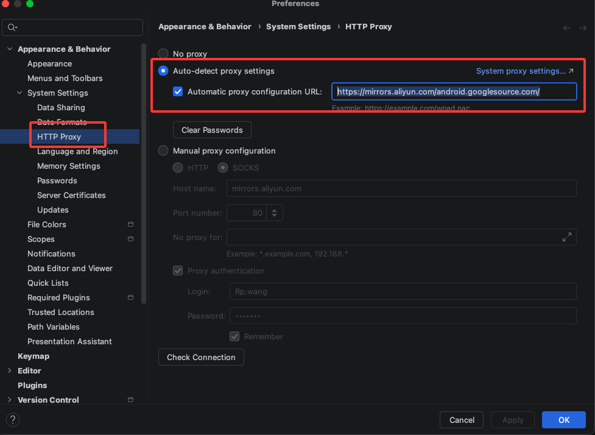

#### How to build?

##### 1、如何让项目跑起来

* 1、设置Android Studio国内代理，可选择腾讯或阿里代理  

```
https://mirrors.aliyun.com/android.googlesource.com/  
```

  

* 2、 阿里镜像  

```
distributionUrl=https\://mirrors.aliyun.com/macports/distfiles/gradle/gradle-9.4.1-bin.zip  
```

腾讯镜像  

```
distributionUrl=https\://mirrors.cloud.tencent.com/gradle/gradle-9.4.1-bin.zip  
```
