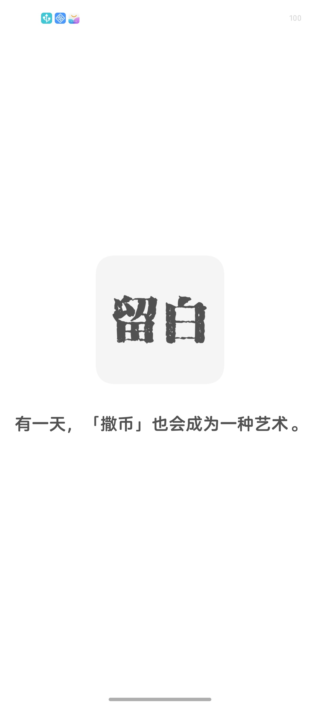
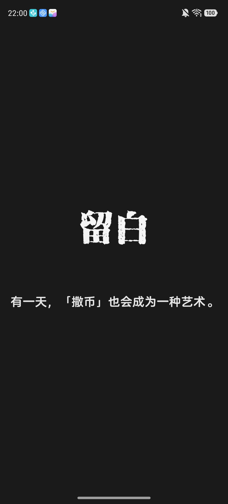

<h3>One day, SaBi will also become an art form.</h3>

<h3>有一天，「撒币」也会成为一种艺术。</h3>

     

## System

| project| System version                 |
| :--- |:------------------------|
| System | Android 10 (API 29) +   |
| Gradle version | 9.4+                    |

[如何让项目跑起来](DOC/howtobuild.md)

