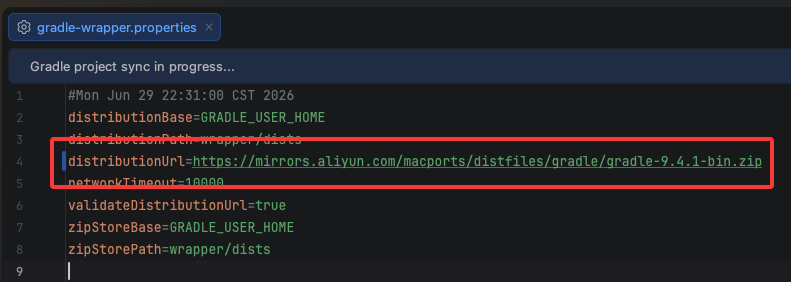

<h3>One day, SaBi will also become an art form.</h3>

<h3>有一天，【撒币】也会成为一种艺术。</h3>

    

## 系统要求

| 项目 | 要求                        |
| :--- |:--------------------------|
| 操作系统 | Android 10 (API 29) 或更高版本 |
| 编译 SDK | Android 16 (API 36)       |
| Gradle 版本 | 9.4+                      |

##### 

##### 1、如何让项目跑起来

* 1、设置Android Studio国内代理，可选择腾讯或阿里代理

```
https://mirrors.aliyun.com/android.googlesource.com/
```


* 2、修改gradle镜像地址为国内镜像
  

阿里镜像

```
distributionUrl=https\://mirrors.aliyun.com/macports/distfiles/gradle/gradle-9.4.1-bin.zip
```

腾讯镜像

```
distributionUrl=https\://mirrors.cloud.tencent.com/gradle/gradle-9.4.1-bin.zip
```
